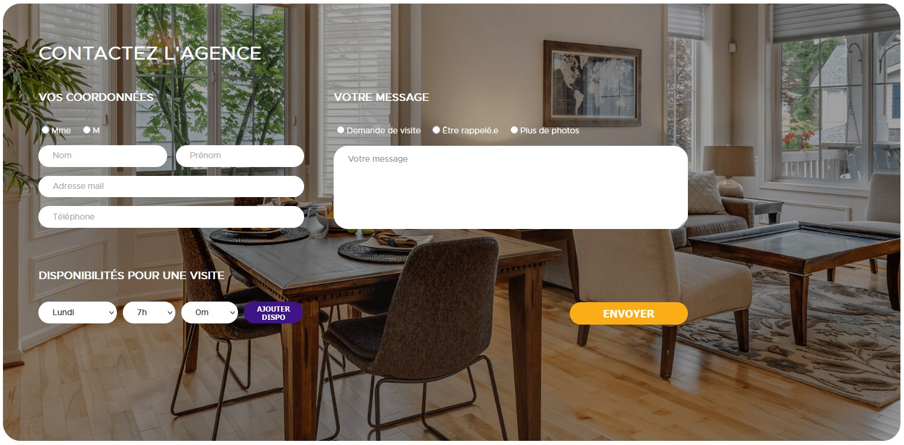

# Test dev web Tremplin

## Qui suis-je

Moi c'est Sonny Pollet, j'ai appris à développer en auto-didacte, et j'ai ensuite obtenu le diplôme de "Développeur intégrateur en réalisation d’applications web" (bac +2) à la 3W Academy. La durée du stage serait de 2 mois.

## Screenshot de la page

## Démarrer l'environnement

> cd front

> npm start

pour ouvrir le front (http://localhost:4200)

> cd back

> npm start

pour ouvrir le back (http://localhost:3000)

## Avez-vous trouvé l'exercice facile ou vous a-t-il posé des difficultés ? Si oui, lesquelles ?

Conceptuellement, c'est quelque chose que j'ai fait des dizaine de fois, alors je savais exactement quoi faire.
Le problème est venu de la contrainte du temps, je n'ai pas pu faire ce à quoi je m'attendais et je me suis trop attardé sur des détails.

## Avez-vous appris de nouveaux outils pour répondre à l'exercice ? Si oui, lesquels ?

J'ai essayé d'apprendre à utiliser Appache (première fois pour moi),
mais les délais m'ont forcés à retourner sur des bases que je connaissais.

## Pourquoi avoir choisi d'utiliser ces outils ?

Parce qu'ils m'étaient familiers.

## Avez-vous utilisé la stack proposée ? 

J'ai essayé.

## Utilisez-vous régulièrement docker ?

J'avais déjà utilisé Docker par le passé, mais pas régulièrement non.